# SignalDock

An Android event SDK designed to save events on the device and confirm server receipt through an ACK after commit.

This monorepo contains the design for the SDK and a local data processing server.
Review the path from an app's `track()` call through a durable queue, retries, server deduplication, and independent artifact installation.

> **Status: 2026-10-09**
> The first release design is complete. Product implementation has not started.
> The behavior below is the agreed design. Runnable artifacts, product setup instructions, and functional and performance results are not yet available.

## Start here

1. [Architecture](architecture.md): component responsibilities, storage ownership, and recovery boundaries.
2. [Architecture SVG](docs/architecture/signaldock-architecture.svg): a static view of the onepager's structure.
3. [Architecture onepager HTML](docs/architecture/signaldock-onepager.html): diagrams, operation sequence, and design Q&A.
4. [Installation identity ADR](docs/adr/0001-installation-scoped-identity.md) and [OpenAPI / JSON ADR](docs/adr/0002-openapi-json-contract.md): decisions and tradeoffs.
5. [First release spec](.scratch/signaldock-portfolio/spec.md): input, ACK, error, lifecycle, and verification contracts.

Download the HTML and open it in a local browser. GitHub's file view does not run the page.
Keep the repository's folder structure so the supporting document links work.

On macOS, run this from the repository root to preview the document:

```sh
open docs/architecture/signaldock-onepager.html
```



## What to review

An SDK's success response tells the host app what it can do next.
SignalDock separates durable device storage from server receipt, with recovery rules for each stage.
This portfolio for the Datarize Mobile SDK Engineer role covers public API design, lifecycle management, recovery, compatibility, and independent distribution.

| Design concern | Decision | Planned evidence, not yet verified |
| --- | --- | --- |
| Offline collection within a storage limit | Collection succeeds at Room commit. At the queue limit, preserve existing events and return `QueueFull` for new calls | 1,000 offline events and process restart; concurrent inserts and capacity boundaries |
| Lost ACKs without duplicate storage | Retry with the same `eventId`. Use a server unique constraint and content comparison; ACK after commit | Block the response after commit; test duplicate and conflict results; compare unique rows and counts |
| Foreground response and background recovery | Share the sender and durable retry state with WorkManager. Keep collection writes separate from the send lock | Sender contention, cancellation, scheduling recovery, and retry waits across restart |
| Shared contracts and independent releases | OpenAPI / JSON with generated source drift checks. Install the Maven ZIP in a separate R8 consumer app | Scalar round trips, earlier fixtures, migrations, artifact installation, and R8 release execution |

## Planned event flow

1. After initialization succeeds, the host app calls `track()`. Collection succeeds after input validation and Room storage.
2. The shared sender checks the earliest retry time and sends a batch. It holds no Room transaction open during HTTP.
3. The server validates each event, handles duplicates, and returns an ACK after PostgreSQL commit.
4. The SDK validates the entire ACK before it applies queue changes atomically. An ambiguous ACK leaves the whole batch in the queue.
5. App diagnostics show the device queue and recent ACK. The Dashboard shows stored server events and their details.

A lost ACK does not change the event ID. The same ID and content produce duplicate success; different content produces a conflict rejection.
Deduplication lasts while the server row exists. The design does not claim exactly-once delivery.

## Planned stack

| Area | Choice |
| --- | --- |
| Android SDK | Kotlin · minSdk 24 · Coroutines · Room · Retrofit / OkHttp · kotlinx.serialization · WorkManager |
| Demo app | Jetpack Compose · ViewModel. The SDK has no dependency on this UI stack |
| Server | Kotlin / Ktor · PostgreSQL · jOOQ · JDBC / HikariCP · Flyway |
| Verification Dashboard | React · TypeScript · Vite · Recharts |
| Contracts and distribution | OpenAPI / JSON · generated sources tracked in Git · Docker Compose entry point · local Maven repository ZIP |

Exact dependency versions need build verification and pinning during implementation.
The planned first coordinate is `local.signaldock:sdk-android:0.1.0`. No installable artifact is available yet.

## Scope and verification

The first release covers a native Android SDK and one local project.
The demo follows product view, cart, and simulated purchase. The Dashboard helps verify SDK integration.
iOS / Flutter, automatic events, `identify`, campaign / push, funnels, multiple accounts, public internet operation, and Maven Central are outside this release.

Functional verification is pending. The [completion criteria](.scratch/signaldock-portfolio/spec.md#7-completion-criteria-and-verification-plan) require environment records, source revision/hash, and event ID comparisons.
Load and latency values in the [performance plan](.scratch/signaldock-portfolio/performance-plan.md) are targets, not measured results or an SLA.
Verified prerequisites and steps to run, integrate, and stop the product will follow once runnable artifacts exist.

## Repository guide

The repository currently holds design documents. Product directories and run examples will follow implementation.
The spec, verification plans, and implementation issues in `.scratch/signaldock-portfolio/` are the approved design sources tracked in Git. Personal conversations and résumé review records are excluded.

| Path | Contents |
| --- | --- |
| [architecture.md](architecture.md) | SDK and server boundaries; ACK, retry, contract, and distribution design |
| [docs/architecture/](docs/architecture/) | Diagrams, onepager HTML, and source text |
| [docs/adr/](docs/adr/) | Installation identity and OpenAPI / JSON decisions |
| [GLOSSARY.md](GLOSSARY.md) | Collection success, receipt success, installation ID, and event ID definitions |
| [.scratch/signaldock-portfolio/spec.md](.scratch/signaldock-portfolio/spec.md) | Detailed design and completion criteria |
| [.scratch/signaldock-portfolio/final-review.md](.scratch/signaldock-portfolio/final-review.md) | Final design review |
| [.scratch/signaldock-portfolio/dashboard-verification-defaults.md](.scratch/signaldock-portfolio/dashboard-verification-defaults.md) | Dashboard query and display defaults |
| [.scratch/signaldock-portfolio/performance-plan.md](.scratch/signaldock-portfolio/performance-plan.md) | Performance test conditions, criteria, and raw data plan |
| [.scratch/signaldock-portfolio/issues/](.scratch/signaldock-portfolio/issues/) | Implementation tasks |

These materials are for private technical evaluation. A public distribution license has not been selected.
