# SignalDock architecture

The SDK stores events on the device and retries with the same `eventId`. It removes acknowledged events only after the server commits them and the SDK validates the ACK.

> **Design baseline: 2026-10-09. Q127 approved.**
> Product implementation has not started. The behavior below is the agreed design; build, device, transport, and performance verification are pending.
> See the [spec](.scratch/signaldock-portfolio/spec.md) for the full contract and the [ADRs](docs/adr/) for the decisions.

## Components and responsibilities

The SDK is the main product. The demo app and Dashboard help verify its behavior.

| Component | Responsibility and boundary |
| --- | --- |
| Host app / Compose demo | Collect business events explicitly after initialization. Do not collect again automatically after recomposition or call cancellation |
| Public SDK API | Validate input, return collection results, and expose read-only diagnostics. Do not expose shopping models or transport DTOs |
| Room / sender | Own the durable queue, capacity checks, batches, ACK application, and retry state shared by foreground work and WorkManager |
| Ktor / PostgreSQL | Validate contracts and the collection key; store and deduplicate events; ACK after commit; expose query APIs |
| React Dashboard | Show server records, details, and supporting counts. Access PostgreSQL only through Ktor |

App diagnostics are a snapshot of the device queue, recent ACK, and next retry.
The Dashboard shows server records. Those records cannot establish the device queue state or retry count.
The collection key checks access for local evaluation. An SDK key can be extracted and does not provide user authentication.

## Collection, delivery, and ACK

### Commit boundaries

1. Room collection commit: return collection success after validation and atomic storage. A server connection is not required.
2. Server commit: store valid events in PostgreSQL, then return per-event ACK results. This establishes server receipt.
3. Room ACK commit: validate the entire ACK and commit queue changes. This records the earlier receipt on the device.

The sender checks the earliest retry time, selects an immutable batch, sends HTTP, validates the entire ACK, and applies it locally.
Foreground work and the Worker serialize this sequence with the same Mutex. Release the lock after each batch and check cancellation and execution conditions.
New `track()` writes use a separate path from the send lock. Hold no Room transaction open during HTTP.

### Validate the entire ACK before changing the queue

Compare the full response with the immutable request list.
Each index, eventId, count, and status must match. Unknown statuses, duplicate indices, mismatched IDs, missing results, or contradictions invalidate the ACK.

| ACK result | Device action |
| --- | --- |
| `accepted` / `duplicate` | Remove the corresponding queue item |
| Known `rejected` | In one transaction, store a recent diagnostic without the event payload and remove the item |
| Unreadable, missing, or contradictory | Apply none of the response. Keep the entire batch; record a protocol diagnostic and apply backoff |

Reset the retry failure count only after the entire valid ACK has been applied locally.
This also applies when every result is a known permanent rejection. A 2xx response or Call completion alone does not reset the count.

## Lost ACKs and event deduplication

If the server commits but the response is lost, the SDK retains its queue items.
It retries with the same IDs and content. The server returns `duplicate` and preserves the first `receivedAt`.
The SDK applies the result after it validates the entire ACK. A timeout does not prove that the server stored nothing.

| Comparison | Server result |
| --- | --- |
| Same ID and content | Duplicate success, with no extra row or count |
| Same ID, different content | Permanent `conflict` rejection; preserve the original row |
| Same ID and content repeated within a batch | Store one row and return a result for each request index |
| Same ID with different content within a batch | Reject the entire group for that ID; process other IDs normally |

The `eventId` unique constraint controls concurrent inserts. On conflict, compare against the committed existing row; a lookup before insertion is insufficient.
Compare name, installationId, occurredAt, sdkVersion, and properties. Exclude receivedAt, batch composition, and request time.
JSON key order has no meaning. Bytes or hashes alone do not establish content equality.
Compare validated numbers by value: `1`, `1.0`, and `1e0` are equal; the string `"1"` is different. Do not use approximate comparison.

Keep eventId through batch splitting and regrouping. The first release has no separate batch Idempotency-Key, response cache, or Redis.
It also has no automatic server TTL or deduplication tombstone. Deduplication of storage and counts lasts while the row remains.
After row deletion or DB reset, an old event can be stored again. The design does not guarantee exactly-once delivery.

## SDK lifecycle and cancellation

Use one SDK instance with one fixed configuration in the default process. Retain only `applicationContext`.
Separate the public API, storage, delivery, scheduling, and diagnostics within one published module. Connect internal dependencies with manual DI.
The SDK has no Compose / ViewModel dependency. Exact public API signatures need to be fixed during implementation.

- Call `track()` after suspend initialization succeeds and returns the SDK instance. Prepare storage off the main thread.
- Concurrent initialization calls with the same configuration share one attempt and result. Reuse a successful instance; reject a different configuration.
- Retry failed initialization through a new explicit host call. Preserve the existing queue and installation ID.
- A caller can cancel its own wait. Shared initialization continues in the SDK's Application / process scope, with no completion guarantee after process death.
- Propagate `CancellationException` from collection. An event may already have committed; collecting the same action again can create a second event with a new ID.
- Store eventId, installationId, occurredAt, the sdkVersion at collection, and the contract version. Preserve them through updates and retries.

Logcat defaults to WARN / ERROR. Even at DEBUG, omit event payloads, event names, installation IDs, credentials, and HTTP bodies.
Start with diagnostics for send start, final result, elapsed time, and next retry. Detailed EventListener instrumentation is deferred.

## Retry and transport boundaries

| Layer | Allowed behavior |
| --- | --- |
| Inside one OkHttp Call | `retryOnConnectionFailure=true`. Allow connection recovery and limited status follow-ups |
| SDK after the final result | Classify the result and persist the next attempt time. After the wait, create a new Call with the same eventId |
| Redirects | Disable automatic redirects, including within the same origin. Do not change the endpoint from Location |
| Server | No separate automatic retry loop for transient DB failures |

Internal Call callbacks do not each increment the SDK failure count. SDK cooldown does not necessarily apply to each intermediate HTTP response.
Queue retention and Retry-After rules apply to the final result. Verify the chosen OkHttp version's behavior during implementation.

| Final failure | SDK policy |
| --- | --- |
| Network / timeout / 408 / 429 / transient 5xx | Keep the queue and persist backoff |
| Authentication, configuration, or contract error / redirect | Pause normal delivery. Check recovery with at most one batch every 30 minutes; send no HTTP request if the queue is empty |
| 413 with multiple events | Split into smaller batches and keep IDs. Do not retry before Retry-After |
| 413 with one event | Diagnose a size contract mismatch, keep the entire queue, and pause normal delivery. Check recovery with that request every 30 minutes |

Backoff base B starts at 10 seconds for the first failure, doubles, and caps at 5 minutes. Full Jitter `U(0, B)` can produce a retry with almost no wait.
Choose and persist the next attempt time once per failure. Honor a longer valid Retry-After and OS constraints, including during recovery checks.
Foreground work and the Worker share this state. Process restart and new triggers do not bypass the wait. Failure count alone never discards an event.

### Agreed defaults, pending measurement

| Item | Value and meaning |
| --- | --- |
| Event / batch | Event: 16 KiB maximum. Entire batch: 256 KiB / 50 events. Measure uncompressed UTF-8 JSON, including escaping and wrappers |
| Queue | At most 10,000 events or 16 MiB of transport JSON in total. Check limits and insert atomically. Keep existing events and return QueueFull for new calls at capacity |
| Foreground | Trigger at 20 events or 10 seconds after storage of the oldest pending event. Honor retry waits |
| Worker | Unique one-time work plus 15-minute periodic recovery. Stop starting batches at 10 batches or a 30-second soft budget |
| HTTP | Call: 30 seconds; connect / read / write: 10 seconds each. The host can set valid positive finite values at initialization |

The queue budget does not cap the Room file size. Measure indices, journals, and sidecars separately. There is no queue TTL.
WorkManager does not promise an exact execution time. The soft budget does not require termination within exactly 30 seconds.
Read / write timeouts limit individual I/O waits. HTTP timeouts and the Worker budget have separate boundaries.

## Contracts, generated sources, and JSON

[ADR-0002](docs/adr/0002-openapi-json-contract.md) selects OpenAPI sources and JSON for collection and queries.
Generate Kotlin models for the SDK / Ktor and TypeScript models for the Dashboard. Keep public API types, Room entities, jOOQ records, and DTOs separate by role.

- Require `SignalDock-Contract-Version: 1` on business APIs. Contract and SDK release versions are separate. The first release implements only contract 1.
- Send queued events under their stored original contract, in batches grouped by contract. Support for old contracts is not indefinite.
- Reject a missing header with HTTP 400. Reject the entire request for an unsupported contract or unknown request contract field, without automatic downgrade. Free properties keys are exempt.
- Ignore compatible extra response fields. Unknown ACK statuses, missing results, and contradictions still invalidate the entire ACK.
- Properties accept flat string / number / boolean values. Reject arrays, nested objects, explicit null, duplicate keys, and leading or trailing whitespace in names or keys. Do not silently correct input.
- Integers must fit ±(2^53−1); decimals must be finite Double values. Apply the integer limit through the Double path too. Reject NaN / Infinity. Use strings for large IDs and integers in the smallest currency unit for exact amounts within range.
- Compare text without Unicode normalization. Reject NUL and lone surrogates. Use UTC RFC 3339 timestamps with milliseconds. The server accepts valid offsets but does not truncate excess precision.

Track generated OpenAPI Kotlin / TypeScript and jOOQ sources in Git. Do not edit them directly.
CI is planned to regenerate into an empty temporary output with fixed inputs and tools, then check added, deleted, and changed files.
Normal compilation must not overwrite generated sources. Keep schema diffs, earlier JSON fixtures, compilation, and storage/ACK integration checks.
Verify scalar adapters and generator compatibility during implementation. Generated types that compile do not prove input validation or release compatibility.

## DB time budgets and queries

JDBC blocks. Bound concurrency in an IO execution area from connection acquisition through transaction completion and connection return.
Design admission and connection waits, SQL, commit and response, and error cleanup within one request budget.
If admission cannot complete within the limit, return HTTP 503 with a positive Retry-After.

Set `lock_timeout < statement_timeout` and apply limits in the transaction on the same connection.
Statement timeout does not set a deadline for the whole transaction. A timeout response proves neither absence of storage nor rollback or connection recovery.
Verify rollback or connection disposal after errors, setting leaks on pool reuse, and the cancellation/commit boundary separately.
Normal runtime values are undecided. Do not copy the [benchmark profile](.scratch/signaldock-portfolio/performance-plan.md) into normal runtime settings automatically.

Apply Flyway migrations to a temporary PostgreSQL schema, generate jOOQ sources, then compile the server.
Do not reset the runtime DB for codegen. Add new migrations instead of editing applied migrations.
Store common fields in typed columns and properties in JSONB. Query with COUNT / GROUP BY; use no separate counter or aggregation Worker.

| Query boundary | Design |
| --- | --- |
| List | Newest-first receivedAt / eventId cursor. Default 50, maximum 100 records; exact name / installationId / eventId filters |
| Period / buckets | Initial project timezone: Asia/Seoul. [start, end), at most 30 calendar dates. At most 720 hourly / daily buckets |
| Refresh | Poll every 5 seconds while visible; stop while hidden and prevent overlapping identical requests. Keep past pages and details in place |
| Errors | Transient failures use 5→10→20→30-second backoff and a longer Retry-After. Explicit contract errors stop polling |

The cursor is not a snapshot, commit order, or change stream. One traversal may miss concurrent inserts or late commits.
List and aggregate responses can reflect different times. Stored event JSON is not the original HTTP bytes, and the timestamp difference is not pure network latency.

## Installation lifecycle and durability

[ADR-0001](docs/adr/0001-installation-scoped-identity.md) uses a UUIDv4 installation ID in SDK-owned `noBackupFilesDir` storage.
Exclude the queue, diagnostics, retry state, and DB sidecars from backup too. Preserve the host app's other backup settings.
Keep SDK data across normal restarts and updates of the same installation. Do not carry it across data clearing, reinstallation, or supported device restores.
These transitions can lose unsent events. The design does not cover every manufacturer's transfer tool or arbitrary host restore.
Configure the server to preserve its DB volume across normal shutdown and restart. Treat DB reset as a separate operation.

## Independent distribution and verification

The planned artifact is a Maven repository ZIP with an AAR, POM, and metadata.
Planned coordinate: `local.signaldock:sdk-android:0.1.0`. Public Kotlin package: `local.signaldock`. No artifact is available yet.
Install by coordinate in an independent Gradle consumer app; verify an R8 release build, execution, and server integration without an SDK source project dependency.
Android and server use separate Gradle builds. The Dashboard and consumer app also keep independent builds.
Document the local entry point after implementation and verification. Reproduction that includes initial dependency downloads is not fully offline.

| Evidence | Required result | Status |
| --- | --- | --- |
| Collection / recovery | Normal E2E; preserve IDs and content for 1,000 offline events through process restart | Pending |
| ACK / deduplication | ACK loss after commit, duplicate / conflict, partial rejection, entire batch retained for ambiguous ACKs | Pending |
| Concurrency / lifecycle | Sender contention, cancellation, capacity and initialization races, updates, reinstallation, sidecar backup exclusion | Pending |
| DB resources | Locks, slow SQL, pool exhaustion, cancellation, rollback, connection reuse, and uncertain commits | Pending |
| Contracts / distribution | Scalar round trips, schema diffs, fixtures, generated source drift, migrations, independent Maven ZIP installation, and R8 | Pending |
| Android performance | Track p50 / p95, actual injection rate, queue drain, DB / sidecar size, and memory | Unmeasured |
| Server performance | Collection and query HTTP latency; ID comparisons, errors, resources, and pool 2 / 4 / 8 comparison | Unmeasured |

The [performance plan](.scratch/signaldock-portfolio/performance-plan.md) baseline has 24 conditions × 3 pool sizes × 3 runs = 216 runs.
Each run has 1 minute of warmup and 5 minutes of measurement: at least 21 hours 36 minutes of automated execution, excluding setup and recovery.
100 events/s and collection ACK p95 ≤ 500 ms are injection and acceptance targets. Direct HTTP load and SDK performance need separate results.
Record the environment, source revision/hash, fixtures, actual request rate, errors, and eventId comparisons. Performance figures do not compensate for correctness failures.

## Decisions and tradeoffs

| Choice | Cost | Source |
| --- | --- | --- |
| Installation identity and SDK backup exclusion | Lose continuity and unsent data across reinstallation and restore | [ADR-0001](docs/adr/0001-installation-scoped-identity.md) |
| OpenAPI / JSON with generated sources in Git | Maintain generation paths, drift checks, and scalar validation | [ADR-0002](docs/adr/0002-openapi-json-contract.md) |
| Event deduplication and a shared sender | Deduplication depends on row retention; serialization is limited to one process | [Spec](.scratch/signaldock-portfolio/spec.md) |
| Direct SQL and aggregation at query time | Measure query cost, indices, and DB waits | [Performance plan](.scratch/signaldock-portfolio/performance-plan.md) |
| SDK verification Dashboard | Prioritize receipt lists and details over analytics features | [Dashboard defaults](.scratch/signaldock-portfolio/dashboard-verification-defaults.md) |

[Final design review](.scratch/signaldock-portfolio/final-review.md) · [Glossary](GLOSSARY.md) · [Onepager HTML](docs/architecture/signaldock-onepager.html) · [README](README.md)
